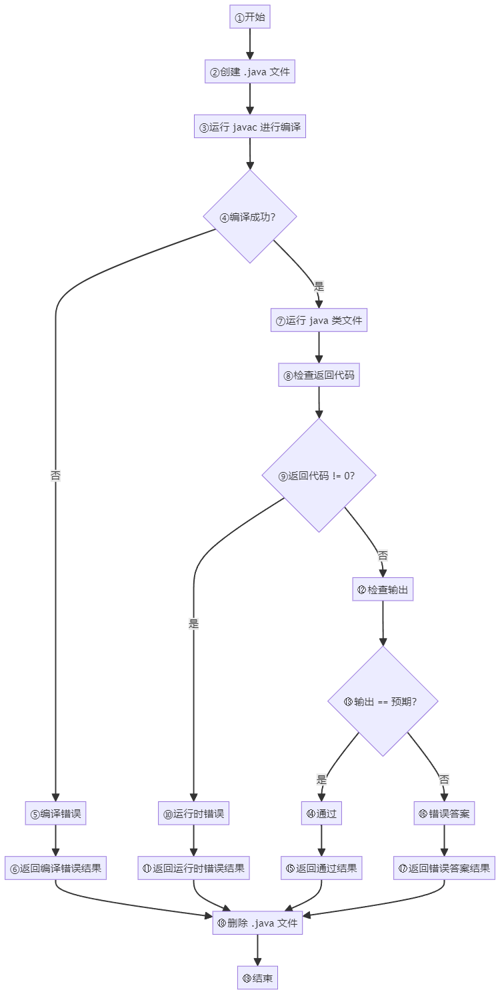
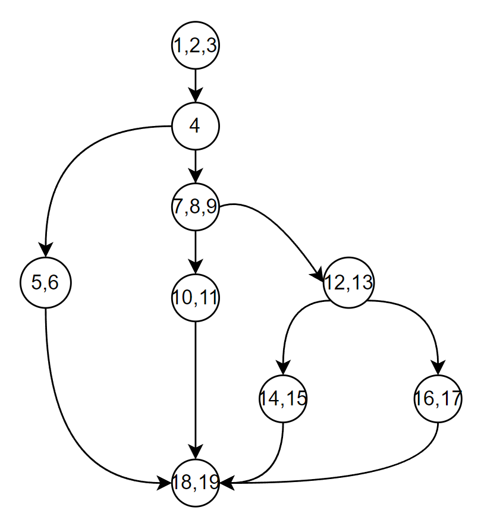
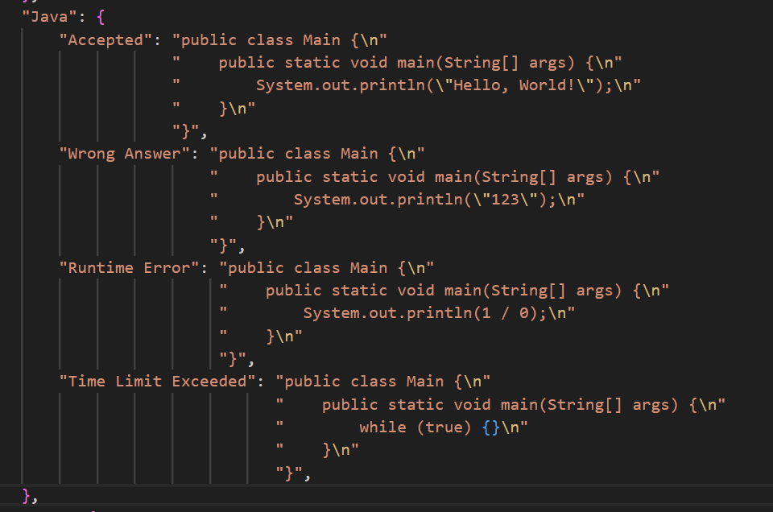

# 5.2. 测试计划

## 5.2.1. 测试条件

测试资源需求包括：

- **硬件设备**:
  - 服务器: 阿里云
  - 客户端计算机: 多台运行Windows、macOS的计算机，以覆盖不同用户环境。
- **软件**:
  - 操作系统: Windows/macOS
  - 数据库: PostgreSQL,Redis
  - 浏览器: Chorme,IE
- **人员**:
  - 测试(负责设计和执行测试用例):何泽民
  - 开发(负责系统开发和bug修复):其余组员

## 5.2.2. 测试方案设计

### 5.2.2.1. 黑盒测试

#### （1）注册模块

| 1.明确需求：                                                                                                                                                       |
| ------------------------------------------------------------------------------------------------------------------------------------------------------------------ |
| 用户名：未注册的用户名，1到32位字符     密码：6到20位字符     电子邮箱：非空字符+@+非空数字或字母+域名后缀   确认密码：输入与密码相匹配 验证码：输入图片对应验证码 |

| 2.划分等价类：     |                                                |                                                                               |
| ------------------ | ---------------------------------------------- | ----------------------------------------------------------------------------- |
| **输入数据** | **有效等价类**                           | **无效等价类**                                                          |
| 用户名             | (1)  非空字符，未注册                          | (2)  空字符     (3)用户名字符数超过32位     (4)用户名已经注册                 |
| 密码               | (5)6到20位字符                                 | (6)空字符     (7) 少于6位字符     (8) 多于20位字符                            |
| 确认密码           | (9)输入与密码相同                              | (10)输入与密码不同                                                            |
| 电子邮箱           | (11)  非空字符 + @ + 非空数字或字母 + 域名后缀 | (12)  空字符     (13) 缺少@     (14) 缺少域名后缀     (15) 缺少非空数字或字母 |
| 验证码             | (16)输入图片对应验证码                         | (17)未输入验证码     (18)输入与图片不同验证码                                 |
| 选择身份           | (19)选择学生或教师之一                         | (20)未选择                                                                    |

| 3.生成测试用例表：                                                                                       |                      |                       |                        |
| -------------------------------------------------------------------------------------------------------- | -------------------- | --------------------- | ---------------------- |
| **测试数据**                                                                                       | **期望结果**   | **测试范围**    | **用例全局编号** |
| 用户名: lsts1,      密码: pass123,     确认密码:pass123      邮箱: lsts@qq.com     验证码:图片对应验证码 | 注册成功             | (1),(5),(9),(11),(16) | 1                      |
| 用户名为空                                                                                               | 提示输入用户         | (2),                  | 2                      |
| 用户名字符数超过32位（1235456789123456789123456789123456                                                 | 提示用户名过长       | (3),                  | 3                      |
| 用户名已注册（lsts）                                                                                     | 提示用户名已存在     | (4),                  | 4                      |
| 密码为空                                                                                                 | 提示输入密码         | (6),                  | 5                      |
| 密码短于6位(12345)                                                                                       | 提示密码过短         | (7),                  | 6                      |
| 密码长于20位(123456789abcdefghijkl)                                                                      | 提示密码过长         | (8),                  | 7                      |
| 输入与密码不同                                                                                           | 提示密码不匹配       | (10),                 | 8                      |
| 邮箱为空                                                                                                 | 提示输入邮箱         | (12),                 | 9                      |
| 邮箱缺少@ (lsts23h.com)                                                                                  | 提示邮箱缺少@        | (13),                 | 10                     |
| 邮箱缺少域名后缀(lsts@qq)                                                                                | 提示邮箱缺少域名后缀 | (14),                 | 11                     |
| 邮箱缺少非空数字或字母(lsts@.com)                                                                        | 提示邮箱缺少关键字段 | (15),                 | 12                     |
| 验证码输入为空                                                                                           | 显示请输入验证码     | (17),                 | 13                     |
| 输入与图片不同验证码                                                                                     | 显示验证码错误       | (18),                 | 14                     |
| 未选择教师或学生身份复选框                                                                               | 提示请选择身份       | (20),                 | 15                     |

#### （2）登录模块

| 1.明确需求：                                             |
| -------------------------------------------------------- |
| 用户名：已经注册的用户名     密码：正确的6到20位字符密码 |

| 2.划分等价类：     |                      |                                |
| ------------------ | -------------------- | ------------------------------ |
| **输入数据** | **有效等价类** | **无效等价类**           |
| 用户名             | (1) 已经注册的用户名 | (2) 空字符     (3)用户名未注册 |
| 密码               | (4)6到20位正确密码   | (5)空字符     (6)错误密码      |

| 3.测试用例表：                     |                             |                    |                        |
| ---------------------------------- | --------------------------- | ------------------ | ---------------------- |
| **测试数据**                 | **期望结果**          | **测试范围** | **用例全局编号** |
| 已注册的用户名，正确的密码（lsts） | 登录成功,进入主页界面       | (1),(4)            | 16                     |
| 用户名为空                         | 显示请输入用户名            | (2),               | 17                     |
| 未注册的用户名（lsts123）          | 点击登录，显示 用户名未注册 | (3),               | 18                     |
| 密码为空                           | 显示请输入密码              | (5),               | 19                     |
| 密码错误                           | 点击登录，显示密码错误 ”   | (6),               | 20                     |

#### （3）题目创建模块

| 题目创建模块                                                                                                                                                                                                                                                                                                                                                                                                                                                                                                                                                                                                                                                                                                                                                                                             |
| -------------------------------------------------------------------------------------------------------------------------------------------------------------------------------------------------------------------------------------------------------------------------------------------------------------------------------------------------------------------------------------------------------------------------------------------------------------------------------------------------------------------------------------------------------------------------------------------------------------------------------------------------------------------------------------------------------------------------------------------------------------------------------------------------------- |
| **1.明确需求：**                                                                                                                                                                                                                                                                                                                                                                                                                                                                                                                                                                                                                                                                                                                                                                                   |
| 1.显示ID:不为空且不超过32个字符，且未存在相同的题目ID<br />2.题目：不为空且不超过1024个字符     <br />3.描述：不为空     <br />4.输入描述：不为空     <br />5.输出描述：不为空     <br />6.时间限制：最小值为1，最大值为60000，只能输入数字，非数字无法显示在输入框      <br />7.内存限制：最小值为2，最大值为1025，只能输入数字，非数字无法显示在输入框，     <br />8.难度：默认低，可选中，高     <br />9.标签：至少添加一个标签，且标签不为空且不超过32个字符    <br />10.可选编程语言：至少选择一项     <br />11.输入样例：不为空，至少设置一个     <br />12.输出样例：不为空，至少设置一个     <br />13.提示：可为空     <br />14.代码模版：不为空    <br />15.测试类型：默认ACM     <br />16.测试用例：至少导入一份文件     <br />17.IO类型：默认选项即可     <br />18.来源：可为空，最多256个字符 |

| 2.划分等价类：     |                                                    |                                                                      |
| ------------------ | -------------------------------------------------- | -------------------------------------------------------------------- |
| **输入数据** | **有效等价类**                               | **无效等价类**                                                 |
| 显示ID             | (1) 非空字符且不超过32个字符，且未存在相同的题目ID | (2)  空字符；     (3)超过32个字符；     (4)已存在相同的题目ID；      |
| 题目               | (5) 非空字符且不超过1024个字符                     | (6)  空字符；     (7)超过1024个字符                                  |
| 描述               | (8) 非空字符                                       | (9) 空字符                                                           |
| 输入描述           | (10) 非空字符                                      | (11) 空字符                                                          |
| 输出描述           | (12) 非空字符                                      | (13) 空字符                                                          |
| 时间限制           | (14) 1到60000之间的数字                            | (15)  小于1；     (16)大于60000的数字；     (17)非数字               |
| 内存限制           | (18) 2到1025之间的数字                             | (19)  小于2；     (20)大于1025的数字；     (21)非数字                |
| 难度               | (22) 低、中、高                                    | 无                                                                   |
| 标签               | (23) 至少一个非空字符且不超过32个字符              | (24)  有标签但空字符；     (25)有标签但超过32个字符；     (26)无标签 |
| 可选编程语言       | (27) 至少选择一项                                  | (28) 未选择任何编程语言                                              |
| 输入样例           | (29) 非空字符，至少设置一个                        | (30)设置了输入样例但为空字符；     (31)未设置任何输入样例            |
| 输出样例           | (32) 非空字符，至少设置一个                        | (33)设置了输出样例但为空字符；     (34)未设置任何输出样例            |
| 提示               | (35) 可为空                                        | 无                                                                   |
| 代码模版           | (36) 非空字符                                      | (37) 空字符                                                          |
| 测试类型           | (38) ACM                                           | 无                                                                   |
| 测试用例           | (39) 至少导入一份文件                              | (40) 未导入任何文件                                                  |
| IO类型             | (41) 默认选项即可                                  | 无                                                                   |
| 来源               | (42) 可为空，最多256个字符                         | (43)超过256个字符                                                    |

| 3.测试用例             |                                                                                                                                                                                                                                                                                                                                                                                         |                                                        |                                                                                        |
| ---------------------- | --------------------------------------------------------------------------------------------------------------------------------------------------------------------------------------------------------------------------------------------------------------------------------------------------------------------------------------------------------------------------------------- | ------------------------------------------------------ | -------------------------------------------------------------------------------------- |
| **用例全局编号** | **输入数据**                                                                                                                                                                                                                                                                                                                                                                      | **期望结果**                                     | **等价类编号**                                                                   |
| TC001                  | 显示ID：12345，题目：测试题目，描述：这是一个测试题目，     输入描述：输入两个整数A,B，用空格隔开，     输出描述：输出一个整数，表示这两个数的和，     时间限制：1000，内存限制：256，难度：低，标签：标签1，     可选编程语言：Java，输入样例：3 4，输出样例：7，提示：无，     代码模版：public class Main {}，测试类型：ACM，测试用例：已导入文件，     IO类型：默认，来源：测试来源 | 题目成功增加，显示在题目列表中                         | (1),(5),(8),(10),(12),(14),(18),(22),(23),(27),(29),(32),(35),(36),(38),(39),(41),(42) |
| TC002                  | 显示ID：为空，其余同测试样例TC001                                                                                                                                                                                                                                                                                                                                                       | 题目增加失败，显示错误信息：显示ID不能为空             | (2)                                                                                    |
| TC003                  | 显示ID：123456789012345678901234567890123，其余同测试样例TC001                                                                                                                                                                                                                                                                                                                          | 题目增加失败，显示错误信息：显示ID不能超过32个字符     | (3)                                                                                    |
| TC004                  | 显示ID：12345（为已经布置过的题目ID）,其余同测试样例TC001                                                                                                                                                                                                                                                                                                                               | 题目增加失败，显示错误信息：显示ID已存在               | (4)                                                                                    |
| TC005                  | 题目：为空，其余同测试样例TC001                                                                                                                                                                                                                                                                                                                                                         | 题目增加失败，显示错误信息：题目不能为空               | (6)                                                                                    |
| TC006                  | 题目：输入超过1024个字符，其余同测试样例TC001                                                                                                                                                                                                                                                                                                                                           | 题目增加失败，显示错误信息：题目不能超过1024个字符     | (7)                                                                                    |
| TC007                  | 描述：为空，其余同测试样例TC001                                                                                                                                                                                                                                                                                                                                                         | 题目增加失败，显示错误信息：描述不能为空               | (9)                                                                                    |
| TC008                  | 输入描述：为空，其余同测试样例TC001                                                                                                                                                                                                                                                                                                                                                     | 题目增加失败，显示错误信息：输入描述不能为空           | (11)                                                                                   |
| TC009                  | 输出描述：为空，其余同测试样例TC001                                                                                                                                                                                                                                                                                                                                                     | 题目增加失败，显示错误信息：输出描述不能为空           | (13)                                                                                   |
| TC010                  | 时间限制：0，其余同测试样例TC001                                                                                                                                                                                                                                                                                                                                                        | 题目增加失败，显示错误信息：时间限制必须在1到60000之间 | (15)                                                                                   |
| TC011                  | 时间限制：60001，其余同测试样例TC001                                                                                                                                                                                                                                                                                                                                                    | 题目增加失败，显示错误信息：时间限制必须在1到60000之间 | (16)                                                                                   |
| TC012                  | 时间限制：100a，其余同测试样例TC001                                                                                                                                                                                                                                                                                                                                                     | 题目增加失败，显示错误信息：时间限制必须为数字         | (17)                                                                                   |
| TC013                  | 内存限制：1，其余同测试样例TC001                                                                                                                                                                                                                                                                                                                                                        | 题目增加失败，显示错误信息：内存限制必须在2到1025之间  | (19)                                                                                   |
| TC014                  | 内存限制：1026，其余同测试样例TC001                                                                                                                                                                                                                                                                                                                                                     | 题目增加失败，显示错误信息：内存限制必须在2到1026之间  | (20)                                                                                   |
| TC015                  | 内存限制：25a，其余同测试样例TC001                                                                                                                                                                                                                                                                                                                                                      | 题目增加失败，显示错误信息：内存限制必须为数字         | (21)                                                                                   |
| TC016                  | 标签：设置标签但为空，其余同测试样例TC001                                                                                                                                                                                                                                                                                                                                               | 题目增加失败，显示错误信息：标签不能为空               | (24)                                                                                   |
| TC017                  | 标签：超过32个字符语句，其余同测试样例TC001                                                                                                                                                                                                                                                                                                                                             | 题目增加失败，显示错误信息：标签不能超过32个字符       | (25)                                                                                   |
| TC018                  | 标签：未设置标签，其余同测试样例TC001                                                                                                                                                                                                                                                                                                                                                   | 题目增加失败，显示错误信息：至少设置一个标签           | (26)                                                                                   |
| TC019                  | 可选编程语言：为空，其余同测试样例TC001                                                                                                                                                                                                                                                                                                                                                 | 题目增加失败，显示错误信息：至少选择一个编程语言       | (28)                                                                                   |
| TC020                  | 输入样例：未设置，其余同测试样例TC001，                                                                                                                                                                                                                                                                                                                                                 | 题目增加失败，显示错误信息：至少设置一个输入用例       | (31)                                                                                   |
| TC021                  | 输入样例：设置了但为空，其余同测试样例TC001，                                                                                                                                                                                                                                                                                                                                           | 题目增加失败，显示错误信息：输入样例不能为空           | (30)                                                                                   |
| TC022                  | 输出样例：未设置，其余同测试样例TC001，                                                                                                                                                                                                                                                                                                                                                 | 题目增加失败，显示错误信息：至少设置一个输入用例       | (34)                                                                                   |
| TC023                  | 输出样例：为空，其余同测试样例TC001                                                                                                                                                                                                                                                                                                                                                     | 题目增加失败，显示错误信息：输出样例不能为空           | (33)                                                                                   |
| TC024                  | 代码模版：为空，其余同测试样例TC001                                                                                                                                                                                                                                                                                                                                                     | 题目增加失败，显示错误信息：代码模版不能为空           | (37)                                                                                   |
| TC025                  | 测试用例：未导入文件，其余同测试样例TC001                                                                                                                                                                                                                                                                                                                                               | 题目增加失败，显示错误信息：至少导入一个测试用例文件   | (40)                                                                                   |
| TC026                  | 来源：输入超过256个字符                                                                                                                                                                                                                                                                                                                                                                 | 题目增加失败，显示错误信息：来源输入不能超过256个字符  | (43)                                                                                   |

### 5.2.2.2. 白盒测试

#### （1）编译模块

```
这里选择后端编译中的Java语言编译函数进行白盒测试，函数头定义如下：
```

主要功能为根据提交的代码对象submission，进行编译运行并检验正确性。

```
def execute_java(problem, submission, test_case, hash_name, result):
```

1. 构建程序流程图

   
2. 构建程序流图

   
3. 确定环路复杂度

   观察图：可知该环路复杂度 = 边数—结点数 + 2 = 11-9+2 = 4
4. 确定基本路径集

   - 路径1（编译错误）：1,2,3->4->5,6->18,19
   - 路径2（编译正确，运行时错误）：1,2,3->4->7,8,9->10,11->18,19
   - 路径3（编译，运行均通过，输出结果与预期相同）：1,2,3->4->7,8,9->12,13->14,15->18,19
   - 路径4（编译，运行均通过，输出结果与预期不同）：1,2,3->4->7,8,9->12,13->16,17->18,19
5. 设计测试用例，执行独立路径集合中的每条路径：
6. | 路径编号 | 输入数据                                     | 预期结果          | 用例编号 |
   | -------- | -------------------------------------------- | ----------------- | -------- |
   | 1        | 不合法的 Java 代码                           | Compilation Error | 1        |
   | 2        | 合法的 Java 代码，但在执行时会产生运行时错误 | Runtime Error     | 2        |
   | 3        | 合法的 Java 代码，输出与预期结果匹配         | Accepted          | 3        |
   | 4        | 合法的 Java 代码，输出与预期结果不匹配       | Wrong Answer      | 4        |
7. 具体测试样例代码截图

   
