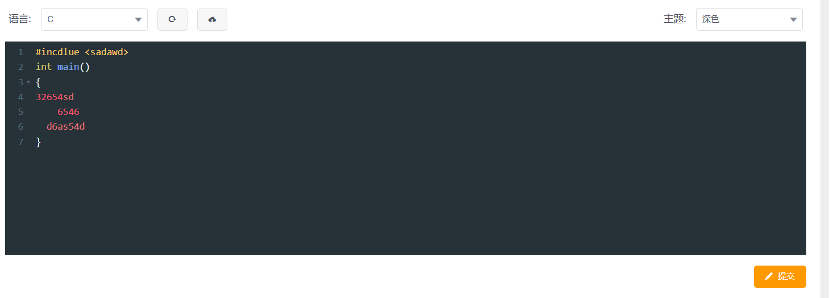
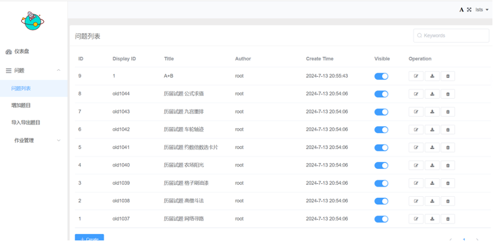

# 6.4. 使用说明

## 6.4.1. 安装和初始化

运行本项目需要两个部分，文件夹名分别为frontend和backend，代表前端和后端的代码。

运行前端首先需要下载node js，推荐版本为8.12.0或14.12.0。在frontend文件夹下运行`npm install`命令，该命令会根据package.json文件下载所需的依赖等配置，运行后文件夹里会多出一个名为ndoe_modules的文件夹。

然后将 NODE_ENV 环境变量设置为 development，告诉 Node.js 应用程序你正在使用开发环境，对于linux用户，使用

```bash
export NODE_ENV=development
```

对于windows用户，使用

```bash
set NODE_ENV=development
```

接下来运行`npm run build:dll`，该命令会使用Webpack打包你的项目中的依赖库，并生成一个 DLL（动态链接库）文件。然后设置TARGET变量为项目的后端地址，如127.0.0.1:8000.

对于linux用户，使用

```bash
export TARGET=http://Your-backend
```

对于windows用户，使用
  
```bash
set TARGET=http://Your-backend
```

可通过查看TARGET变量的值检验是否设置正确。最后使用`npm run dev`指令，前端项目会运行在本地的8080端口上，若最终终端信息如下，说明前端配置成功，并且会自动跳转到前端的页面


运行后端，首先需要一个支持项目运行的环境，具体配置在requirements.txt中，运行`pip install -r requirements.txt`指令安装，推荐使用conda配置虚拟环境。配置好环境后，在backend文件夹下，执行脚本文件init_db.sh初始化数据库，然后运行`python managy.py runserver 0.0.0.0:8000`，将服务器启动在本地8000端口上，若最终终端信息如下，说明后端配置成功


## 6.4.2. 运行步骤

### 6.4.2.1. 登陆与注册

登录与注册按钮在页面右上角


若未注册过账户，首先点击注册按钮跳转到注册页面，输入要求信息即可。在角色这一栏有两个选项，分别为学生和教师，因为教师拥有网站的管理员权限，可管理题目和作业，因此为教师设置了邀请码。在具体生产环境中，教师需要询问网站拥有者，也即超级管理员获得邀请码。为方便课设检查，我们在此处给出邀请码：邀请码为12345。


注册好后，自动跳转到登录界面，正确输入账号密码后即可登录使用网站


### 6.4.2.2. 使用题库

题库界面如下图所示


点击上方题目选项后进入题库页面，可点击某一道题目进入对应题目的详情页面，如题目A+B, 页面如下


可查看题目描述、题目输入与题目输出的信息，同时提供了测试样例以及题目提示

往下滑动可看到题目的答题部分


左上角可选择语言，目前支持C、C++、python、Java。语言下拉框还可选择JavaScript和Golang，不过目前我们没有实现。

语言下拉框旁边两个按钮分别表示重置代码、上传文件，点击右下角提交后，网站会对代码进行编译与评分。

右上角主题会更换代码框的主题，目前有三种，下面展示深色主题



提交后左下角会显示具体的信息


点击编译失败按钮可以看到错误详情


点击题目描述页面右上角的提交信息按钮，可看到所有用户在该题目上的提交情况


点击对应题目ID，可查看这次评判的具体情况；点击问题，可进入该题目的详情页面。点击作者，可进入作者个人页面


### 6.4.2.3. 题库管理(仅限教师或管理员)

通过在网址后加上/admin，或者点击右上角的后台管理可进入管理页面


教师的管理页面如下


问题列表如下



右侧三个按钮分别为编辑、下载测试用例和删除题目

编辑题目页面即为增加题目页面


上方每一个文本框类似日新工大的作业提交框，支持改变字体、添加序号、上传图片和文件等功能，也支持markdown语言，在这里着重说明测试用例的格式。

每一道题的测试用例用x.in、x.out文件表示第x个测试用例的输入与输出，完成后将所有测试用例打包为压缩文件，然后上传到网站即可，上传文件最大为2M。具体如下：


下面是导入导出题目界面


点击左边的方框可选择导出的题目


点击export后下载文件。每一道题目文件夹下有两部分，一个是testcase文件夹，存放测试用例，格式和上方的一样；一个是problem.json文件，存放题目的基本信息。


导入题目的格式和上方一致


### 6.4.2.4. 作业管理(仅限教师或管理员)

作业管理界面如下


发布作业页面如下，可在作业列表编辑与删除作业


右边四个按钮分别表示编辑作业信息、编辑作业的题目列表、编辑作业公告以及下载作业的提交情况

编辑作业题目页面如下，下方两个按钮分别为创建题目和从公共题库中添加题目。因为教师布置作业可能会考虑到给学生布置一个不同于题库中的题目，所以这里有Create选项。


下载作业的提交情况时有个选项为是否排除管理员的提交。因为管理员，也即老师也可以做题目，但老师查看作业情况时并不需要老师的提交，所以会有该选项供用户选择。


### 6.4.2.5. 用户管理(仅限管理员)

用户管理界面如下


可看到用户的基本信息，右边两个按钮分别表示编辑用户和删除用户。编辑用户界面如下


用户类型包括普通用户、管理员和超级管理员，问题权限包括无、只拥有自己创建的题目的权限和拥有所有题目的权限


### 6.4.2.6. 查看作业

点击上方的教学按钮跳转到教学页面，也即是作业页面。该页面可查看每一次作业的具体情况。


点击作业可进入作业详情页面


点击题目可进入题目界面，该界面与上方的题目界面一致


提交信息处可查看作业的提交情况，具体为作业中每一道题目的提交情况


## 6.4.3. 出错和恢复

### 6.4.3.1. 无法注册

注册用户时可能遇到无法注册，提示server error，此时可能是服务器出现问题，联系网站负责人进行修复


### 6.4.3.2. npm run dev出错

在运行前端时，该指令出错，结果可能如下


可能是依赖问题，重新执行npm run build:dll。若还有问题，可以尝试升级node js版本为v14.12.0或v16。
