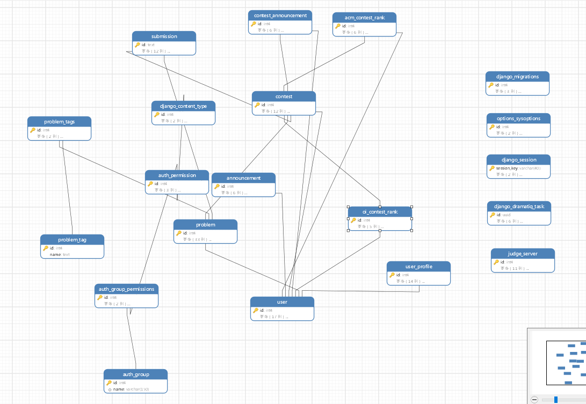

# 3.数据库设计
## 3.1. ER图设计

## 3.2. 表设计
<p style="text-indent:2em;">暂时设计了10个表，具体如下

### 3.2.1. 权限表
<p style="text-indent:2em;"> 每一个ID对应一个权限名，具体功能根据后续需求进行设计。具体设计代码如下：

```
CREATE TABLE 权限 (
    权限ID INT IDENTITY(1,1) PRIMARY KEY,
    权限名 NVARCHAR(50) NOT NULL UNIQUE
);
```
<p style="text-indent:2em;">主键为权限ID，权限名添加唯一约束与非空约束

### 3.2.2. 角色表
<p style="text-indent:2em;"> 每一个角色ID对应一个角色名，如游客、学生、管理员等，不同角色拥有不同的权限，因此权限字段通过外键与权限表连接。具体设计代码如下：

```
CREATE TABLE 角色 (
    角色ID INT IDENTITY(1,1) PRIMARY KEY,
    权限ID INT,
    角色名 NVARCHAR(20) NOT NULL UNIQUE,
    FOREIGN KEY (权限ID) REFERENCES 权限(权限ID)
);
```
<p style="text-indent:2em;"> 主键为角色ID，角色名添加唯一约束与非空约束，权限ID添加外键约束与权限表连接

### 3.2.3. 用户表
<p style="text-indent:2em;"> 除开基本的用户名和密码外，用户信息也可包括个人邮箱号，方便后续的操作，如向邮箱发送网站最新信息、教师给学生发送邮件提醒等功能。除此之外，根据需求文档说明，用户可拥有多种角色，如管理员、学生、教师等。为了后续方便拓展新身份，将该字段通过外键与角色表连接起来，并且拥有不同的权限。具体设计代码如下：</p>

```
CREATE TABLE 用户 (
    用户ID INT IDENTITY(1,1) PRIMARY KEY,
    用户名 NVARCHAR(50) NOT NULL,
    电子邮件 NVARCHAR(100) NOT NULL UNIQUE,
    密码哈希 NVARCHAR(255) NOT NULL,
    角色ID INT,
    创建时间 DATETIME DEFAULT GETDATE(),
    FOREIGN KEY (角色ID) REFERENCES 角色(角色ID)
);
```
<p style="text-indent:2em;"> 主键为用户ID。考虑到每个邮箱只能绑定一个账号，电子邮件添加唯一约束。角色ID添加外键约束与角色表连接。

### 3.2.4. 题目表
<p style="text-indent:2em;"> 每道题目拥有独一的id，除此之外，参考市面上的OJ平台的每道题目的形式，添加标题、描述、输入描述、输出描述、示例输入、示例输出字段，根据我们项目的需求，添加题目的难度字段，方便用户根据自身需求查找对应难度的题目，后续还会加上算法描述字段以让用户查找具体算法对应的题目。实际效果如下，参考市面上的oj平台：


具体设计代码如下
```
CREATE TABLE 题目 (
    题目ID INT IDENTITY(1,1) PRIMARY KEY,
    标题 NVARCHAR(100) NOT NULL,
    描述 NVARCHAR(MAX) NOT NULL,
    输入描述 NVARCHAR(MAX) NOT NULL,
    输出描述 NVARCHAR(MAX) NOT NULL,
    示例输入 NVARCHAR(MAX),
    示例输出 NVARCHAR(MAX),
    难度 NVARCHAR(10) CHECK (难度 IN ('简单', '中等', '困难')) DEFAULT '中等',
    创建时间 DATETIME DEFAULT GETDATE()
);
```
<p style="text-indent:2em;"> 主键为题目ID。难度字段添加检查约束与默认约束，难度包括简单、中等和困难，默认中等。

### 3.2.5. 提交表
<p style="text-indent:2em;"> 该表的功能不仅是把数据给后端评测程序处理，还保存了每一次用户提交的代码和结果等，方便用户查找之前的提交记录以及对比每一次提交的结果，实际效果对应上图中的提交记录tab。具体设计代码如下：

```
CREATE TABLE 提交 (
    提交ID INT IDENTITY(1,1) PRIMARY KEY,
    用户ID INT NOT NULL,
    题目ID INT NOT NULL,
    代码 NVARCHAR(MAX) NOT NULL,
    编程语言 NVARCHAR(10) CHECK (编程语言 IN ('C', 'C++', 'Java', 'Python', '其他')) NOT NULL,
    提交时间 DATETIME DEFAULT GETDATE(),
    FOREIGN KEY (用户ID) REFERENCES 用户(用户ID),
    FOREIGN KEY (题目ID) REFERENCES 题目(题目ID)
);
```
<p style="text-indent:2em;"> 主键为提交ID，编程语言字段添加检查约束与非空约束。用户ID与题目ID分别通过外键约束与用户表和题目表连接。

### 3.2.6. 评测结果表
<p style="text-indent:2em;"> 该表保存了评测结果，后续通过该表向前端显示对应的结果，如通过、超时、错误答案等。我们也考虑到用户可能会用不同的算法解决问题，为了对比哪种算法更优，该表也保存了执行时间和内存使用量的数据。具体设计代码如下：

```
CREATE TABLE 评测结果 (
    结果ID INT IDENTITY(1,1) PRIMARY KEY,
    提交ID INT NOT NULL,
    评测结论 NVARCHAR(20) CHECK (评测结论 IN ('通过', '错误答案', '超时', '内存超限', '运行时错误', '编译错误', '其他')) NOT NULL,
    执行时间 DECIMAL(10, 3), -- 执行时间（秒）
    内存使用量 INT, -- 内存使用量（KB）
    创建时间 DATETIME DEFAULT GETDATE(),
    FOREIGN KEY (提交ID) REFERENCES 提交(提交ID)
);
```
<p style="text-indent:2em;"> 主键为结果ID，评测结论字段添加检查约束与非空约束。提交ID通过外键约束与提交表连接

### 3.2.7. 测试用例表
<p style="text-indent:2em;"> 该表保存了每道题目的测试用例的信息。具体设计代码如下：

```
CREATE TABLE 测试用例 (
    测试用例ID INT IDENTITY(1,1) PRIMARY KEY,
    题目ID INT NOT NULL,
    输入数据 NVARCHAR(MAX) NOT NULL,
    输出数据 NVARCHAR(MAX) NOT NULL,
    创建时间 DATETIME DEFAULT GETDATE(),
    FOREIGN KEY (题目ID) REFERENCES 题目(题目ID)
);
```
<p style="text-indent:2em;"> 主键为测试用例ID。题目ID通过外键约束与题目表连接

### 3.2.8. 教师学生表
<p style="text-indent:2em;"> 该表关联了教师与学生的信息，具体一个教师可对应多个学生，一个学生也可对应多个教师。具体教师表与学生表根据后续需求再进行设计。具体设计代码如下：

```
CREATE TABLE 教师学生 (
    教师ID INT NOT NULL,
    学生ID INT NOT NULL,
    PRIMARY KEY (教师ID, 学生ID),
    FOREIGN KEY (教师ID) REFERENCES 用户(用户ID),
    FOREIGN KEY (学生ID) REFERENCES 用户(用户ID)
);
```
<p style="text-indent:2em;"> 主键为教师ID和学生ID的组合，教师ID和学生ID通过外键约束分别连接用户表的用户ID字段。
