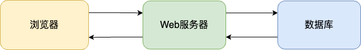
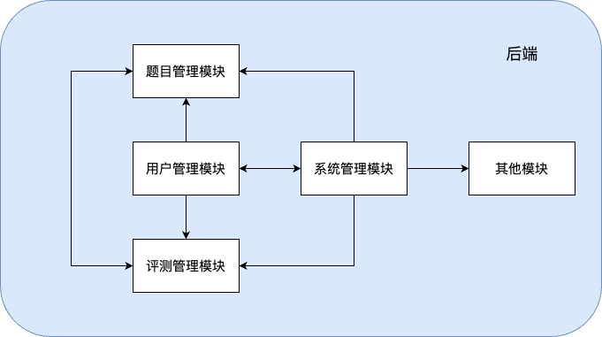

# 3.2. 概要设计

## 3.2.1. 系统模块划分

系统主要分为前端和后端两个部分，前端主要负责用户的交互界面，后端主要负责业务逻辑的处理。

后端主要包括以下模块：

+ **用户管理模块**：负责用户的注册、登录、信息修改、密码找回等功能。
+ **题目管理模块**：负责题目的添加、修改、删除、查询等功能。
+ **评测管理模块**：负责评测的提交、评判、结果查询等功能。
+ **系统管理模块**：负责系统的配置、日志查看、用户权限管理等功能。
+ **其他模块**：包括系统的首页、帮助文档、关于我们等功能。

## 3.2.2. 系统架构设计

本系统采用B/S架构，前端使用Vue.js框架, 后端使用Django框架, 数据库使用MySQL(暂定).

系统的架构如下：

其中后端的架构和模块划分如下：

