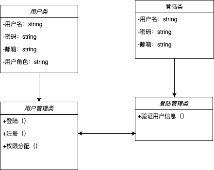
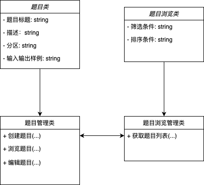
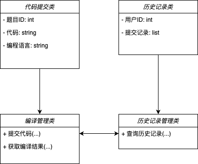

# 3.5. 模块详细设计

##  3.5.1. 用户管理模块

### 3.5.1.1. 用户注册

- **类图**:  

  - **用户类**: 包含用户名、密码、邮箱、用户角色等属性  

  - **用户管理类**: 包含注册、登录、权限分配等方法
  - **关系说明**：用户管理类和登录管理类之间有依赖关系，用户管理类可以调用登录管理类的方法进行用户验证

  

- **伪码**：	

```C++
class Database {
public:
    bool insertUser(string username, string password, string email, string role) {
        // 模拟向数据库插入用户信息
        if (username.empty() || password.empty()) {
            return false;
        }
        // 假设插入成功
        return true;
    }
};

string registerUser(string username, string password, string email, string role) {
    if (username.empty() || password.empty()) {
        return "错误: 用户名或密码不能为空";
    } else {
        Database db;
        bool success = db.insertUser(username, password, email, role);
        if (success) {
            return "成功: 用户注册成功";
        } else {
            return "错误: 用户注册失败";
        }
    }
}
```


### 3.5.1.2. 用户登录

- **类图**:  

  - **登陆类**: 包含用户名、密码、邮箱等属性

  - **登陆管理类**: 包含验证用户信息的方法
  - **关系说明**：用户管理类和登录管理类之间有依赖关系，用户管理类可以调用登录管理类的方法进行用户验证

  

  

- **伪码**：	

```c++
#include <iostream>
#include <string>
using namespace std;

class Database {
public:
    bool verifyUser(string username, string password) {
        // 模拟验证用户名和密码
        if (username == "user123" && password == "password") {
            return true;
        }
        return false;
    }
};

string loginUser(string username, string password) {
    if (username.empty() || password.empty()) {
        return "错误: 用户名或密码不能为空";
    } else {
        Database db;
        bool success = db.verifyUser(username, password);
        if (success) {
            return "成功: 用户登录成功";
        } else {
            return "错误: 用户名或密码错误";
        }
    }
}

```


## 3.5.2.  题目管理模块

### 3.5.2.1. 题目创建

- **类图**:  

  - **题目类**: 包含题目标题、描述、分区、输入输出样例等属性

  - **题目管理类**: 包含创建、浏览、编辑题目等方法
  - **关系说明**：题目管理类和题目浏览管理类之间有依赖关系，题目管理类负责题目的创建和编辑，题目浏览管理类负责获取题目列表。

  

- **伪码**：	

```c++
#include <iostream>
#include <string>
#include <vector>
using namespace std;

// 题目类
class Problem {
public:
    string title;
    string description;
    string category;
    vector<string> inputExamples;
    vector<string> outputExamples;

    Problem(string t, string d, string c, vector<string> inputEx, vector<string> outputEx)
        : title(t), description(d), category(c), inputExamples(inputEx), outputExamples(outputEx) {}
};

// 数据库模拟
vector<Problem> database;

// 创建题目函数
string createProblem(string title, string description, string category, vector<string> inputExamples, vector<string> outputExamples) {
    if (title.empty()) {
        return "错误信息: 题目标题为空";
    } else {
        Problem newProblem(title, description, category, inputExamples, outputExamples);
        database.push_back(newProblem);
        return "成功信息: 题目创建成功";
    }
}

```


### 3.5.2.2. 题目浏览

- **类图**:  

  - **题目浏览类**: 包含筛选条件、排序条件等属性

  - **题目浏览管理类**: 包含获取题目列表的方法
  - **关系说明**：题目管理类和题目浏览管理类之间有依赖关系，题目管理类负责题目的创建和编辑，题目浏览管理类负责获取题目列表。

  

- **伪码**：	

```c++
#include <algorithm>

// 浏览题目函数
vector<Problem> browseProblems(string filterCondition, string sortOrder) {
    // 过滤题目
    vector<Problem> filteredProblems;
    for (const auto& problem : database) {
        if (problem.category == filterCondition || filterCondition == "全部") {
            filteredProblems.push_back(problem);
        }
    }

    // 排序题目
    if (sortOrder == "标题升序") {
        sort(filteredProblems.begin(), filteredProblems.end(), [](const Problem& a, const Problem& b) {
            return a.title < b.title;
        });
    } else if (sortOrder == "标题降序") {
        sort(filteredProblems.begin(), filteredProblems.end(), [](const Problem& a, const Problem& b) {
            return a.title > b.title;
        });
    }

    return filteredProblems;
}
```


## 3.5.3. 编译管理模块

### 3.5.3.1. 代码提交和分数展示

- **类图**:  

  - **代码提交类**: 包含题目ID、代码、编程语言等属性

  - **编译管理类**: 包含提交代码、获取编译结果等方法
  - **关系说明**：编译管理类和历史记录管理类之间有依赖关系，编译管理类负责代码提交和获取编译结果，历史记录管理类负责查询用户的历史提交记录。

  

- **伪码**：	

```c++
#include <iostream>
#include <string>
using namespace std;

// 编译结果类
class CompileResult {
public:
    string status;
    string output;

    CompileResult(string s, string o) : status(s), output(o) {}
};

// 模拟后端响应的函数
CompileResult backendCompile(string problemID, string code, string language) {
    // 模拟编译过程
    if (code.empty()) {
        return CompileResult("失败", "代码为空");
    } else {
        // 假设编译成功
        return CompileResult("成功", "编译成功，输出结果...");
    }
}

// 提交代码函数
CompileResult submitCode(string problemID, string code, string language) {
    // 向后端发送代码提交请求
    CompileResult result = backendCompile(problemID, code, language);
    // 接收编译结果
    // 返回编译结果
    return result;
}
```


### 3.5.3.2. 历史查询

- **类图**:  

  - **历史记录类**: 包含用户ID、提交记录等属性

  - **历史记录管理类**: 包含查询历史记录的方法
  - **关系说明**：编译管理类和历史记录管理类之间有依赖关系，编译管理类负责代码提交和获取编译结果，历史记录管理类负责查询用户的历史提交记录。

  

- **伪码**：	

```c++
#include <vector>

// 提交记录类
class SubmissionRecord {
public:
    string problemID;
    string status;
    string timestamp;

    SubmissionRecord(string pID, string s, string t) : problemID(pID), status(s), timestamp(t) {}
};

// 模拟数据库
vector<SubmissionRecord> submissionDatabase;

// 查询历史记录函数
vector<SubmissionRecord> queryHistory(string userID) {
    vector<SubmissionRecord> historyRecords;
    // 根据用户ID查询数据库
    for (const auto& record : submissionDatabase) {
        if (record.problemID == userID) {  // 假设问题ID存储的是用户ID以示例
            historyRecords.push_back(record);
        }
    }
    // 返回历史提交记录
    return historyRecords;
}
```


