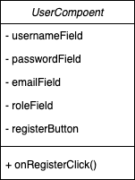

# 3.5. 模块详细设计

##  3.5.1. 用户管理模块

### 3.5.1.1. 用户注册

- **用户类**: 
  - **usernameField**: 用于输入用户名的文本字段。
  - **passwordField**: 用于输入密码的文本字段。
  - **emailField**: 用于输入邮箱的文本字段。
  - **roleField**: 用于选择用户角色的文本字段。
  - **registerButton**: 提交注册信息的按钮。
  - **onRegisterClick()**: 注册按钮的点击事件处理方法。



- **伪码**：	

```C++
// UserComponent.h
class UserComponent {
private:
    string usernameField;
    string passwordField;
    string emailField;
    string roleField;
    Button registerButton;
    
public:
    UserComponent();
    void onRegisterClick();
};

// UserComponent.cpp
UserComponent::UserComponent() {
    // 初始化组件
    registerButton.setOnClickListener(this, &UserComponent::onRegisterClick);
}

void UserComponent::onRegisterClick() {
    string username = usernameField.getText();
    string password = passwordField.getText();
    string email = emailField.getText();
    string role = roleField.getText();
    
    if (username.empty() || password.empty()) {
        showError("用户名或密码不能为空");
    } else {
        sendRegisterRequest(username, password, email, role);
    }
}

void sendRegisterRequest(string username, string password, string email, string role) {
    // 发送注册请求到服务器
    // 处理服务器响应
}

```


### 3.5.1.2. 用户登录

- **用户登录类**: 
  - **usernameField**: 用于输入用户名的文本字段。
  - **passwordField**: 用于输入密码的文本字段。
  - **loginButton**: 提交登录信息的按钮。
  - **onLoginClick()**: 登录按钮的点击事件处理方法。


- **伪码**：	

```c++
// LoginComponent.h
class LoginComponent {
private:
    string usernameField;
    string passwordField;
    Button loginButton;
    
public:
    LoginComponent();
    void onLoginClick();
};

// LoginComponent.cpp
LoginComponent::LoginComponent() {
    // 初始化组件
    loginButton.setOnClickListener(this, &LoginComponent::onLoginClick);
}

void LoginComponent::onLoginClick() {
    string username = usernameField.getText();
    string password = passwordField.getText();
    
    if (username.empty() || password.empty()) {
        showError("用户名或密码不能为空");
    } else {
        sendLoginRequest(username, password);
    }
}

void sendLoginRequest(string username, string password) {
    // 发送登录请求到服务器
    // 处理服务器响应
}

```


## 3.5.2.  题目管理模块

### 3.5.2.1. 题目创建

- **题目类**: 
  - **titleField**: 用于输入题目标题的文本字段。
  - **descriptionField**: 用于输入题目描述的文本字段。
  - **categoryField**: 用于选择题目分类的文本字段。
  - **inputOutputField**: 用于输入题目输入输出样例的文本字段。
  - **createButton**: 提交创建题目信息的按钮。
  - **onCreateClick()**: 创建按钮的点击事件处理方法。


- **伪码**：	

```c++
// ProblemComponent.h
class ProblemComponent {
private:
    string titleField;
    string descriptionField;
    string categoryField;
    string inputField;
    string outputField;
    Button createButton;
    
public:
    ProblemComponent();
    void onCreateClick();
};

// ProblemComponent.cpp
ProblemComponent::ProblemComponent() {
    // 初始化组件
    createButton.setOnClickListener(this, &ProblemComponent::onCreateClick);
}

void ProblemComponent::onCreateClick() {
    string title = titleField.getText();
    
    if (title.empty()) {
        showError("题目标题不能为空");
    } else {
        sendCreateProblemRequest(title, descriptionField.getText(), categoryField.getText(), inputField.getText(), outputField.getText());
    }
}

void sendCreateProblemRequest(string title, string description, string category, string input, string output) {
    // 发送创建题目的请求到服务器
    // 处理服务器响应
}

```


### 3.5.2.2. 题目浏览:  

- **题目浏览类**: 
  - **filterField**: 用于输入筛选条件的文本字段。
  - **sortField**: 用于输入排序条件的文本字段。
  - **problemList**: 显示题目列表的组件。
  - **fetchButton**: 提交筛选和排序请求的按钮。
  - **onFetchClick()**: 获取题目列表按钮的点击事件处理方法。


- **伪码**：	

```c++
// ProblemBrowser.h
class ProblemBrowser {
private:
    string filterCriteria;
    string sortCriteria;
    List problemList;
    
public:
    ProblemBrowser();
    void fetchProblems();
};

// ProblemBrowser.cpp
ProblemBrowser::ProblemBrowser() {
    // 初始化组件
    fetchProblems();
}

void ProblemBrowser::fetchProblems() {
    // 根据筛选条件和排序条件查询题目列表
    sendFetchProblemsRequest(filterCriteria, sortCriteria);
}

void sendFetchProblemsRequest(string filter, string sort) {
    // 发送获取题目列表的请求到服务器
    // 处理服务器响应
}

```


## 3.5.3. 编译管理模块

### 3.5.3.1. 代码提交和分数展示

- **代码提交类**: 

  - **problemIDField**: 用于输入题目ID的文本字段。
  - **codeField**: 用于输入代码的文本字段。
  - **languageField**: 用于选择编程语言的文本字段。
  - **submitButton**: 提交代码的按钮。
  - **onSubmitClick()**: 提交按钮的点击事件处理方法。

  

- **伪码**：	

```c++
// CodeSubmitComponent.h
class CodeSubmitComponent {
private:
    string problemIDField;
    string codeField;
    string languageField;
    Button submitButton;
    
public:
    CodeSubmitComponent();
    void onSubmitClick();
};

// CodeSubmitComponent.cpp
CodeSubmitComponent::CodeSubmitComponent() {
    // 初始化组件
    submitButton.setOnClickListener(this, &CodeSubmitComponent::onSubmitClick);
}

void CodeSubmitComponent::onSubmitClick() {
    string problemID = problemIDField.getText();
    string code = codeField.getText();
    string language = languageField.getText();
    
    sendCodeSubmitRequest(problemID, code, language);
}

void sendCodeSubmitRequest(string problemID, string code, string language) {
    // 发送代码提交请求到服务器
    // 处理服务器响应并返回编译结果
}

```


### 3.5.3.2. 历史查询

- **历史记录查询类**: 
  - **userIDField**: 用于输入用户ID的文本字段。
  - **recordList**: 显示历史记录的组件。
  - **fetchButton**: 提交查询历史记录请求的按钮。
  - **onFetchClick()**: 获取历史记录按钮的点击事件处理方法。


- **伪码**：	

```c++
// HistoryRecordComponent.h
class HistoryRecordComponent {
private:
    string userIDField;
    List recordList;
    Button fetchButton;
    
public:
    HistoryRecordComponent();
    void onFetchClick();
};

// HistoryRecordComponent.cpp
HistoryRecordComponent::HistoryRecordComponent() {
    // 初始化组件
    fetchButton.setOnClickListener(this, &HistoryRecordComponent::onFetchClick);
}

void HistoryRecordComponent::onFetchClick() {
    string userID = userIDField.getText();
    
    sendFetchHistoryRequest(userID);
}

void sendFetchHistoryRequest(string userID) {
    // 根据用户ID查询历史记录
    // 处理服务器响应并返回历史提交记录
}

```


