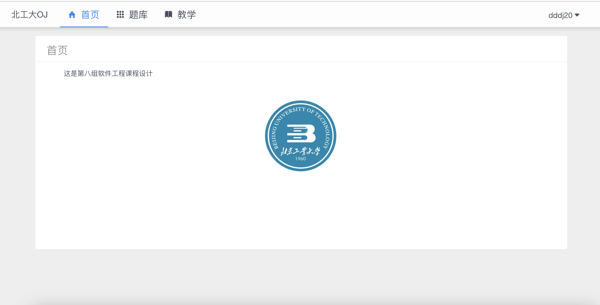
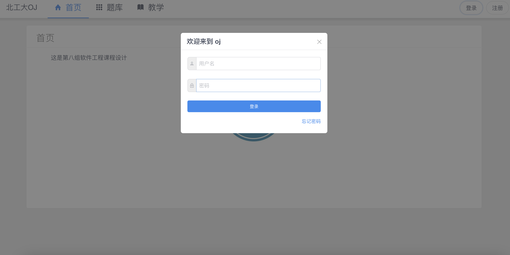
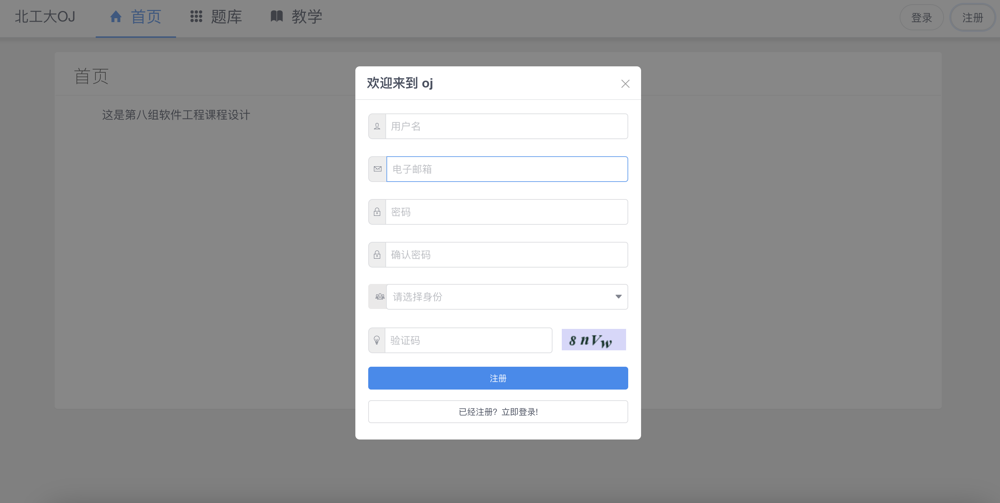
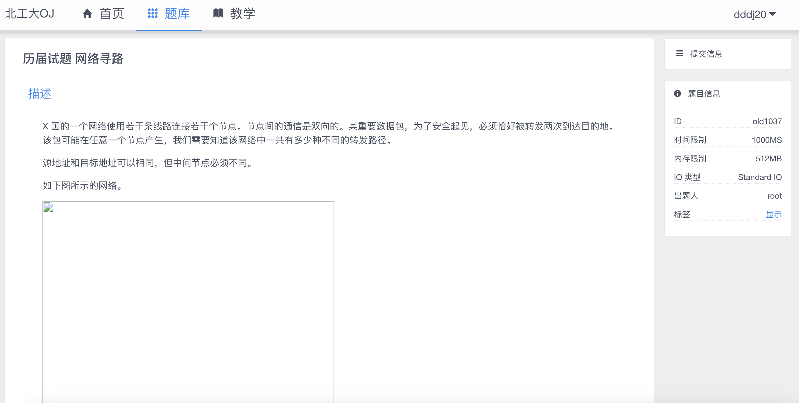
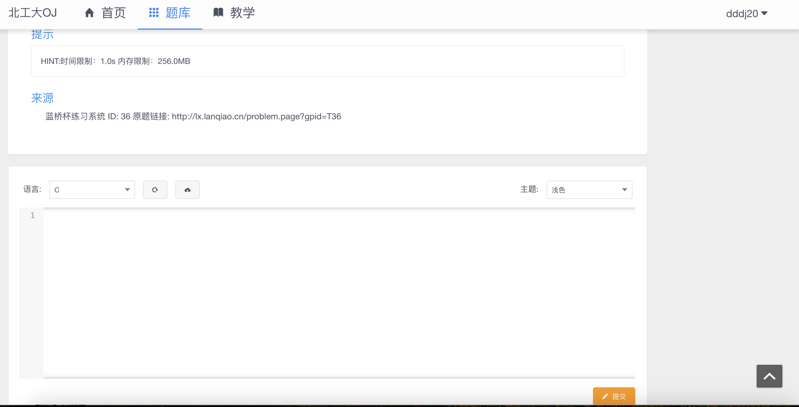
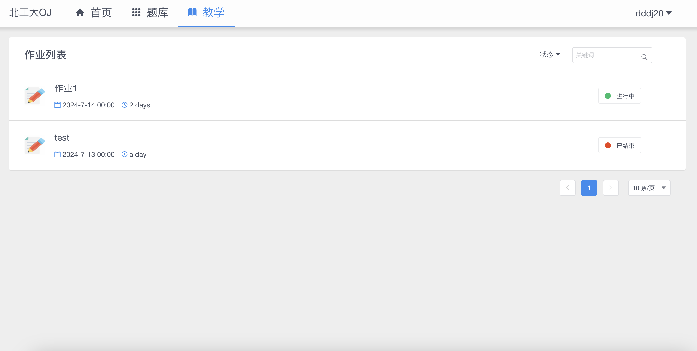
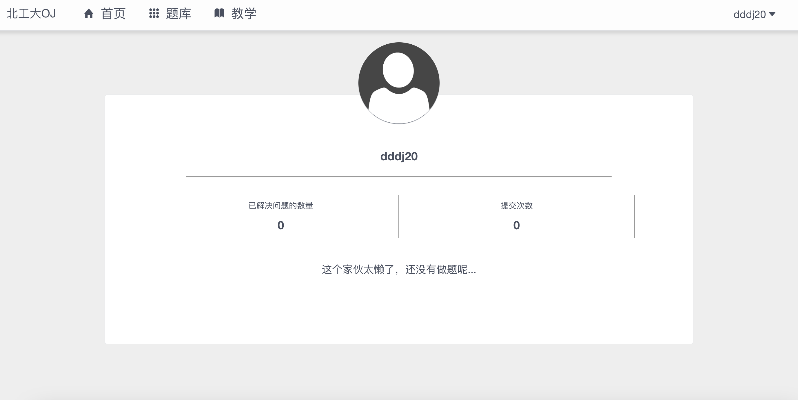
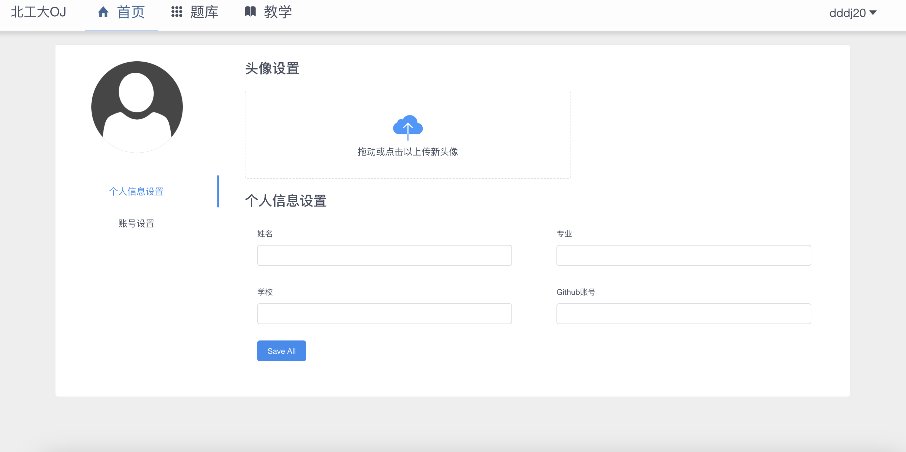
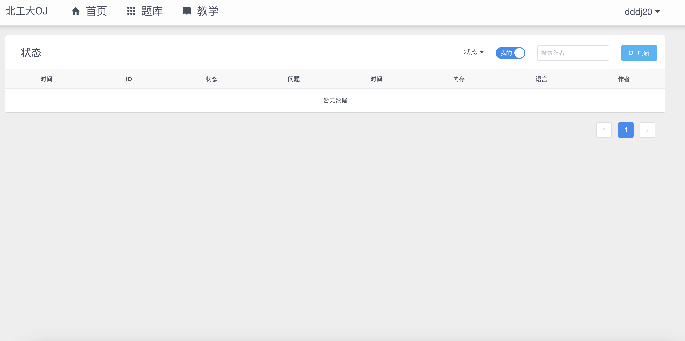

# 3.6. 界面设计

##  3.6.1. 界面样式设计

本组在开发前进行了详细的功能需求分析和界面规划设计，使用即时设计网站设计了原型图，并在开发完成后附上实际程序界面截图，下面进行展示。

### 3.6.1.1. 首页界面

原型界面：

程序界面：

### 3.6.1.2. 登陆界面

原型界面：

程序界面：

### 3.6.1.3. 注册界面

原型界面：

程序界面：

### 3.6.1.4. 题库界面

程序界面：

### 3.6.1.5. 代码提交界面

程序界面：

### 3.6.1.6. 教学界面

程序界面：

作业列表界面：

### 3.6.1.7. 个人主页界面

程序界面：

个人主页界面：

个人信息设置界面：

个人提交信息界面：

## 3.6.2.  界面交互设计

### 3.6.2.1. 页面导航

- **主导航**:
  - 首页公告管理
  - 题库管理
  - 教学管理
  - 登陆管理
  - 注册管理
  - 个人界面管理

### 3.6.2.2. 界面元素和布局设计
- **用户注册页面**

  - **输入框**: 用户名、密码、邮箱、用户角色

  - **按钮**: 注册、取消
- **用户登录页面**

  - **输入框**: 用户名、密码
- **按钮**: 登录、忘记密码

- **题目创建页面**
  - **输入框**: 题目标题、描述、分区、输入输出样例

  - **按钮**: 提交、重置
- **题库做题页面**

  - **输入框**: 输入关键词筛选题目
  - **下拉框**: 选择一页显示题目的数量，例：10条/页
  - **按钮**: 重置关键词筛选，打开/关闭标签
  - **标签**:根据标签进行题目的筛选
  - **标签的隐藏与显示按钮**:对标签进行隐藏与现实以实现对题目算法类型的确认，以免提前知道题目类型，或针对类型题训练。
- **代码提交页面**
  - **输入框**: 代码编辑器

  - **下拉框**: 编程语言选择

  - **按钮**: 提交代码、重置
- **教学页面**

  - **输入框**: 输入关键词筛选作业
  - **下拉框**: 根据状态选择作业，分为进行中和已结束
  - **跳转框**: 作业名字作为跳转选项，点击进入做题详细界面
- **作业页面**

  - **菜单元素**: 界面右侧为菜单栏，分为题目与提交信息，点击实现界面切换
  - **跳转框**: 作业名字作为跳转选项，点击进入编译界面

