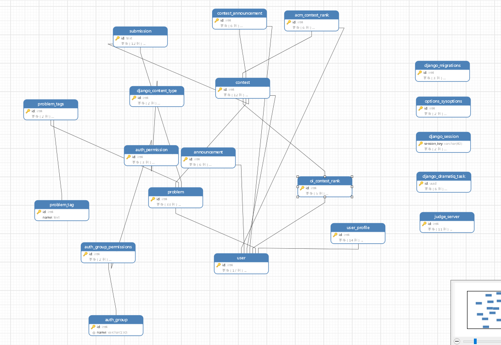

# 2.3. 数据描述

## 2.3.1. 数据建模

## 2.3.2. 数据字典
+ **角色**
  + 角色ID=1..4 注:"1"表示游客,"4"表示管理员
  + 权限ID=1..9999
  + 角色名=NVARCHAR(20)
+ **用户**
  + 用户ID=1..9999
  + 用户名=NVARCHAR(50)
  + 电子邮件=NVARCHAR(100)
  + 密码哈希=NVARCHAR(255)
  + 角色ID=1..4 注:"1"表示游客,"4"表示管理员
  + 创建时间 = 年+月+日+时+分+秒
+ **教师学生关联表**
  + 教师ID= 1..9999
  + 学生ID= 1..9999
+ **题目**
  + 题目ID = 1..9999
  + 标题 = NVARCHAR(MAX)
  + 描述 = NVARCHAR(MAX)
  + 输入描述 = NVARCHAR(MAX)
  + 输出描述 = NVARCHAR(MAX)
  + 示例输入 = NVARCHAR(MAX)
  + 示例输出 = NVARCHAR(MAX)
  + 难度 = ["简单", "中等", "困难"]
  + 创建时间 = 年+月+日+时+分+秒
+ **提交**
  + 提交ID = 1..9999
  + 用户ID = 1..9999
  + 题目ID = 1..9999
  + 代码 = NVARCHAR(MAX)
  + 编程语言 = ["C", "C++", "Java", "Python", "其他"]
  + 提交时间 = 年+月+日+时+分+秒
+ **评测结果**
  + 结果ID = 1..9999
  + 提交ID = 1..9999
  + 评测结论 = ["通过", "错误答案", "超时", "内存超限", "运行时错误", "编译错误", "其他"]
  + 执行时间 = "0000000.001".."9999999.999"
  + 内存使用量 = 0..99999999
  + 创建时间 = 年+月+日+时+分+秒
+ **测试用例**
  + 测试用例ID = 1..9999
  + 题目ID = 1..9999
  + 输入数据 = NVARCHAR(MAX)
  + 输出数据 = NVARCHAR(MAX)
  + 创建时间 = 年+月+日+时+分+秒